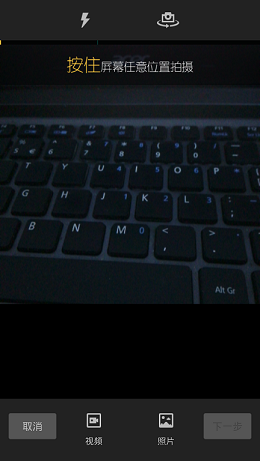
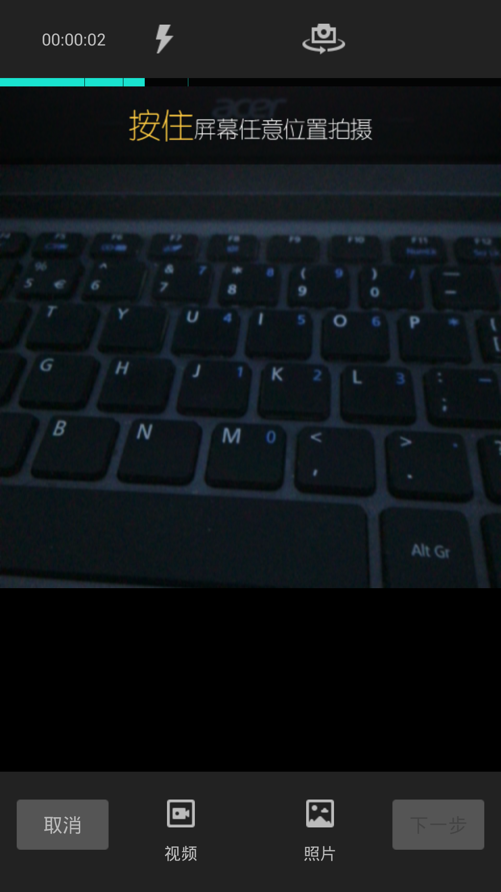
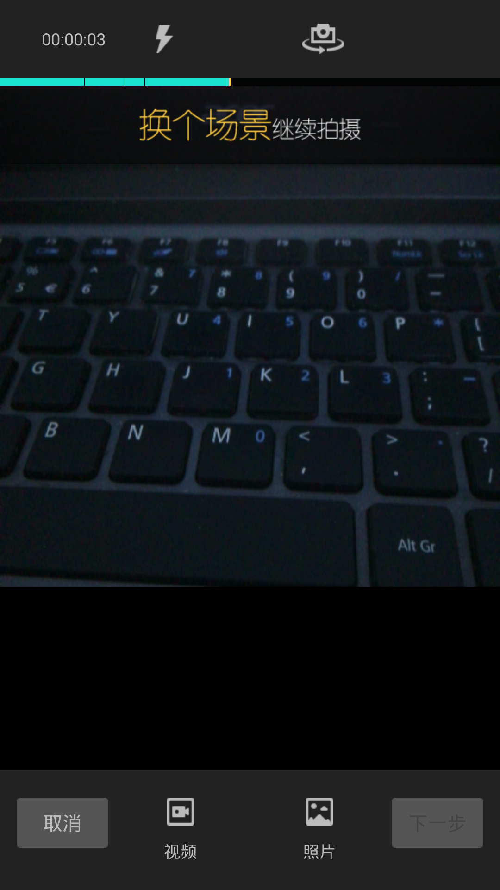
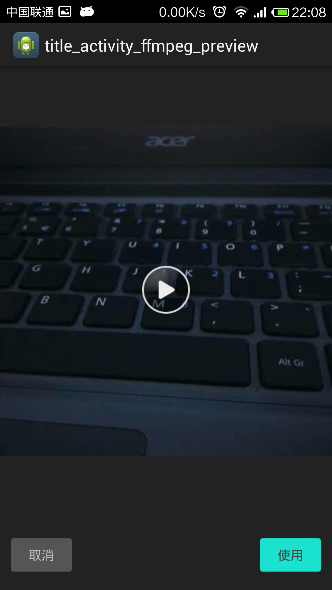
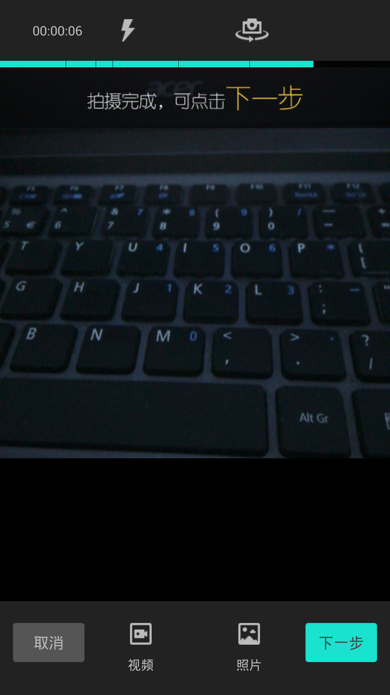

VideoRecorder
=============

android视频录制，模仿微视，支持按下录制、抬起暂停。进度条断点显示。

视频录制存在的问题：

1.如何获取摄像头的数据

2.如何把获取到的数据保存到视频文件中

3.如何录制音频，并和视频合并

4.录制视频时如何实现暂停功能

5.android摄像头支持的分辨率可能不符合需求，需要转换分辨率

6.android手机录制出来的视频是旋转了90度的，如何实现旋转（转换到前置摄像头又如何处理）

7.视频旋转、利用图片合成视频、使用本地视频剪辑、后期视频特效添加等等

这里只是解决了1、2、3、4、5、6。7如果有人知道，希望能够添加到本项目中。

